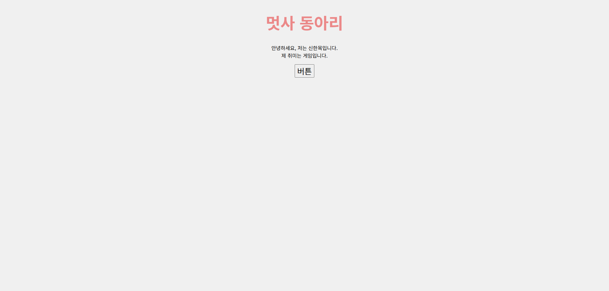
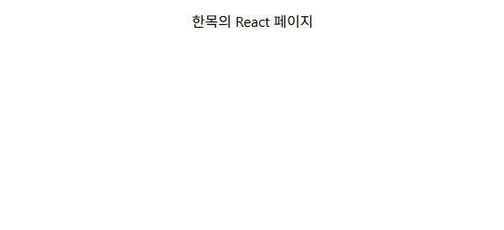
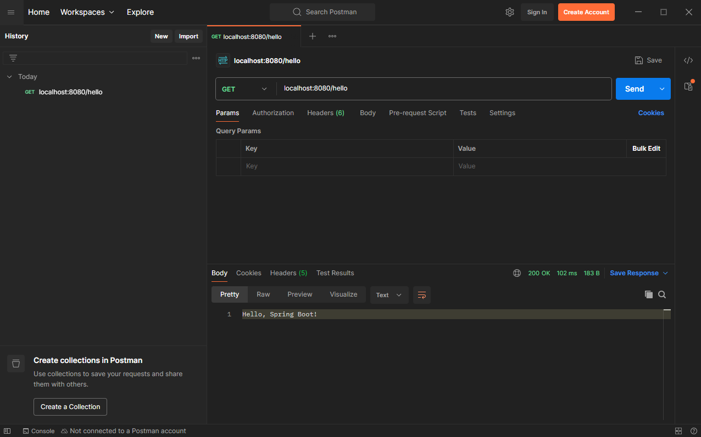

### 실습 2 — 간단한 웹 페이지 (40점)
### HTML 웹
<p align="center">
  
</p>

https://shm3041.github.io/lion/


### 실습 3 — Git & GitHub (25점)
https://github.com/shm3041/lion.git


### 실습 4 — React 프로젝트 실행 (선택, 15점)
### React 웹
<p align="center">
  
</p>

```jsx
// App.js
import './App.css';

function App() {
  return (
    <div className="App">
      <p>한목의 React 페이지</p>
    </div>
  );
}

export default App;
```


### 실습 5 — Spring Boot Hello (선택, 10점)
### Spring Boot 백엔드
<p align="center">
  
</p>

```java
// HelloController.java
package com.lion.hello_api;

import org.springframework.web.bind.annotation.GetMapping;
import org.springframework.web.bind.annotation.RestController;

@RestController
public class HelloController {
    @GetMapping("/hello")
    public String hello() {
        return "Hello, Spring Boot!";
    }
}
```